# 🥊 Mastering Microservices: The Sync vs Async Showdown

> **"Why is my microservice architecture slower than my monolith?"**

This project is a hands-on demonstration of the two most common communication patterns in microservices: **Synchronous (HTTP)** and **Asynchronous (Message Queues)**.

It includes a **Side-by-Side Visualization** so you can *feel* the difference in latency and user experience.

---

## What You Will Learn
By building and running this project, you will understand:
1.  **Coupling**: Why Service A shouldn't crash just because Service B is down.
2.  **Latency**: How blocking calls stack up and kill performance.
3.  **Event-Driven Architecture**: How to use RabbitMQ to decouple services.
4.  **Developer Experience**: How to visualize these concepts for your team.

---

## The Architecture

### 1. The "Sync" Trap (Blocking)
This is how most people start. Service A calls Service B directly.
*   **The Problem**: If Payment takes 3 seconds, Checkout takes 3 seconds. The user waits.
*   **The Risk**: If Payment is down, Checkout throws a 500 Error.

```mermaid
sequenceDiagram
    participant User
    participant Checkout
    participant Payment
    User->>Checkout: POST /checkout
    Note right of User: ⏳ WAITING...
    Checkout->>Payment: POST /pay
    Note right of Checkout: 🛑 BLOCKED
    Payment-->>Checkout: 200 OK (After 3s)
    Checkout-->>User: 200 OK
```



### 2. The "Async" Solution (Non-Blocking)
This is how you scale. Service A sends a message and moves on.
*   **The Benefit**: Checkout responds instantly. The user is happy.
*   **The Resilience**: If Payment is down, the message waits in the Queue. Nothing is lost.

```mermaid
sequenceDiagram
    participant User
    participant Checkout
    participant Queue
    participant Payment
    User->>Checkout: POST /checkout
    Checkout->>Queue: Publish "Order Created"
    Checkout-->>User: 202 Accepted (Instant!)
    Note right of User: ✅ DONE
    Queue->>Payment: Consume Message
    Note right of Payment: ⚙️ Processing in Background...
```



---

## Code Deep Dive
See how simple the code difference is?

### Synchronous (The "Bad" Way)
```python
# services/checkout/main.py (Sync Mode)
import httpx

def checkout(order):
    # 🛑 BLOCKS here until Payment responds
    response = httpx.post("http://payment-service/pay", json=order)
    return response.json()
```

### Asynchronous (The "Good" Way)
```python
# services/checkout/main.py (Async Mode)
import pika

def checkout(order):
    # 🚀 SENDS message and returns immediately
    channel.basic_publish(exchange='', routing_key='order.created', body=json.dumps(order))
    return {"status": "Processing in background"}
```

---

## Run the Demo (The Showdown)

We've built a special **Side-by-Side Mode** that runs both architectures at the same time so you can race them.

### 1. Start the Stack
```bash
docker-compose -f docker-compose.combined.yml up --build
```

### 2. Open the Dashboard
Go to **http://localhost:3000**

### 3. The Challenge
1.  Click **"Trigger Sync Checkout"** (Left).
    *   *Observation*: The UI freezes. You can't do anything for 3 seconds.
    *   *Why*: The browser is waiting for the server, which is waiting for the payment service.
2.  Click **"Trigger Async Checkout"** (Right).
    *   *Observation*: Instant success!
    *   *Why*: The server offloaded the work to RabbitMQ and replied instantly.

---

## Project Structure
Build this yourself! Here are the files you need:

| Service | Description | Key Tech |
| :--- | :--- | :--- |
| **`services/checkout`** | The entry point. Handles user requests. | Python, FastAPI, Pika |
| **`services/payment`** | The worker. Processes payments (slowly). | Python, FastAPI, Pika |
| **`frontend`** | The visualization dashboard. | React, Vite, Tailwind |
| **`docker-compose.combined.yml`** | The magic that runs everything together. | Docker Compose |

---

## Under the Hood Concepts

### Resource Exhaustion
In the Sync model, every waiting request holds a thread or connection open. If you have 1000 users, you need 1000 threads. In Async, you can handle 1000 users with just a few threads because you aren't waiting.

### Load Leveling
If 1000 orders come in at once:
*   **Sync**: Your Payment service crashes under the load.
*   **Async**: The Queue fills up. The Payment service processes them one by one at its own pace. The system survives.